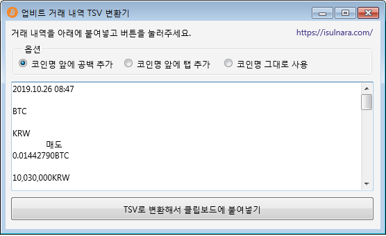

# UpbitHist2Tsv

업비트의 암호화폐 거래 이력을 엑셀에 쉽게 붙여넣을 수 있는 TSV(Tab-Separated Values) 형식으로 변환하는 프로그램입니다.

## 원본 형식
2019.10.26 08:47
	
BTC
	
KRW
	매도	
0.01442790BTC
	
10,030,000KRW
	
144,711KRW
...

## 이 프로그램에 의해 변환된 형식
2019.10.26 08:47 BTC KRW 매도 0.01442790 BTC 10,030,000 KRW 144,711 KRW 72.35 KRW 144,639 KRW 2019.10.26 08:46
2019.10.26 01:01 BTC KRW 매도 0.02000000 BTC 9,766,000 KRW 195,320 KRW 97.66 KRW 195,222 KRW 2019.10.26 00:53
2019.10.25 13:13 BTC KRW 매수 0.01442790 BTC 8,770,000 KRW 126,533 KRW 63.26 KRW 126,596 KRW 2019.10.25 13:13

## 스크린샷

